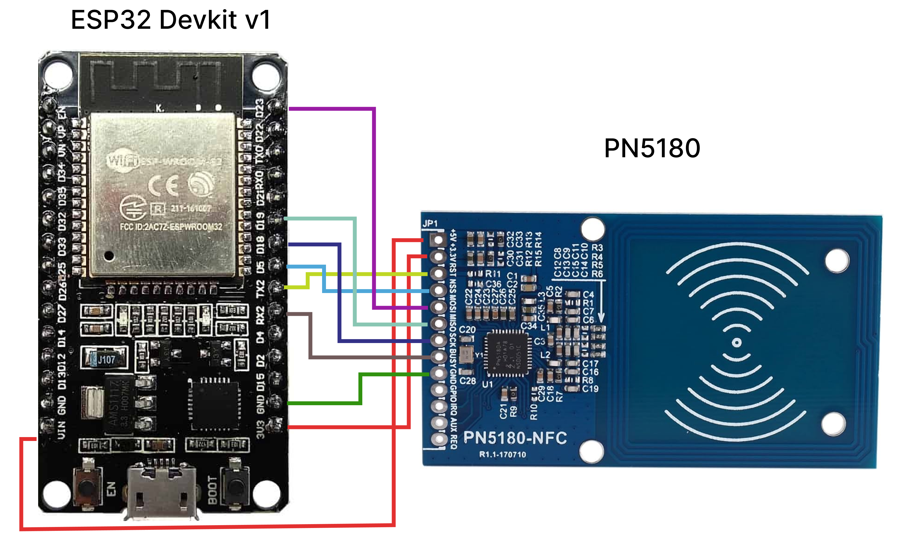

# Leitor NFC ISO 15693 com ESP32 e PN5180

## Descrição
Este projeto utiliza um ESP32 em conjunto com o módulo PN5180 para realizar a leitura de tags NFC do tipo ISO 15693. O código configura o ESP32 para se comunicar com o PN5180, inicializa o leitor NFC, realiza a leitura do ID das tags NFC detectadas e exibe o ID no monitor serial. O processo inclui a verificação da versão do produto do PN5180 e a configuração do campo RF para habilitar a detecção de tags.

## Bibliotecas Utilizadas
- [PN5180ISO15693](https://github.com/Seeed-Studio/PN5180-Library)

## Como Usar
1. Conecte o módulo PN5180 ao ESP32 conforme o mapeamento de pinos abaixo:

| PN5180 | ESP32 |
|--------|-------|
| 5V     | VIN   |
| 3V     | 3V    |
| RST    | TX2   |
| NSS    | D5    |
| MOSI   | D23   |
| MISO   | D19   |
| SCK    | D18   |
| BUSY   | RX2   |
| GND    | GND   |




2. Carregue o código no ESP32 utilizando a IDE Arduino.
3. Abra o monitor serial para visualizar os IDs das tags NFC detectadas.

### Saída
Ao detectar um dispositivo NFC, o monitor serial exibirá:

```log
Dispositivo NFC Detectado... ID: 56 44 F7 B 0 A0 7 E0
```

## Autor
- [Cícero Santos (@cicerosnt)](https://github.com/cicerosnt)
